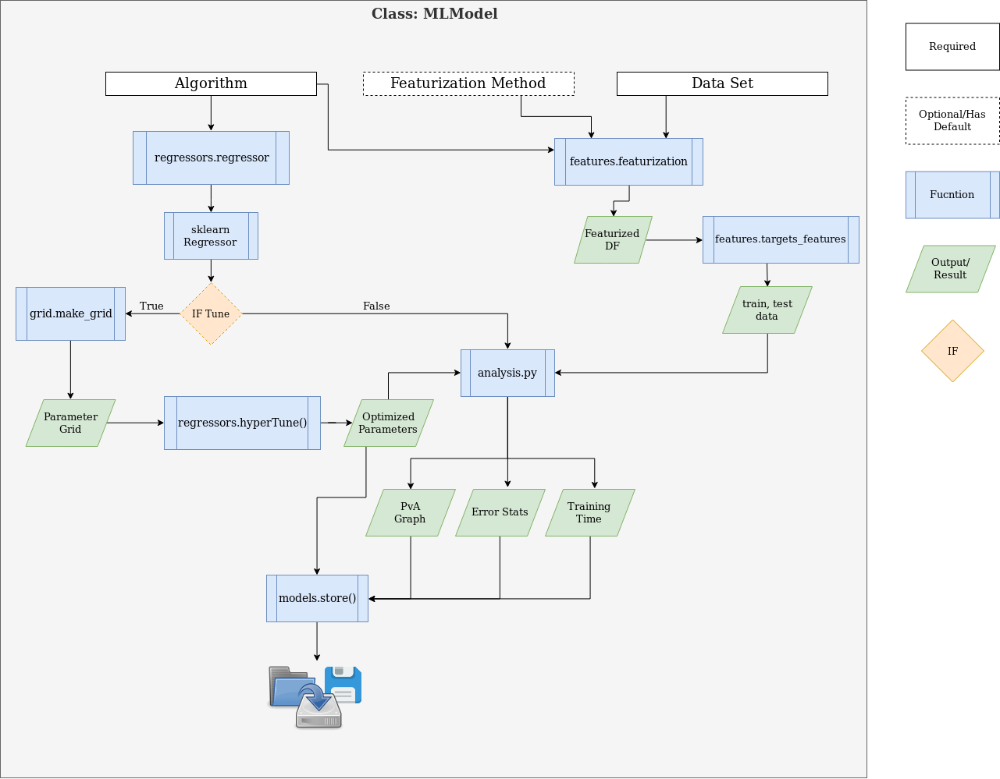

# McQuade-Chem-ML
Development of easy to use and reproducible ML scripts for chemistry.  

## Data Sets
Currently we are using three datasets from MoleculeNet.ai: Lipophilicity, FreeSOLV and ESOL.

## Available Models
Our program supports random forest (RF), gradient decent boost (GDB), support vector machines (SVM).  


### Dependencies
We should all be using the same conda evironment so that we do not run into the issue
of "Well it works on my machine".  To do this, we will host a .yml file for the shared
environment on our repo (mlapp.yml).

1. Create an conda virual environment from the mlapp.yml file
 ```conda env create -f mlapp.yml```
 2. Update the virtual environment as necessary using ```conda install```
 3. Update the mlapp.yml file using ```conda env export > mlapp.yml --no-builds --from-history```. Make sure that you add the 
 mlapp.yml file to git, if it not already being watched.

    **Note:** Sometimes packages cannot be installed from conda, such as descriptastorus.
    If this is the case, you may need to use pip to install from a github link.
    See the mlapp.yml file for an example (descriptastorus) for an example of how to account for this
    in the mlapp.yml file.  
    ```
    - pip:
        - "git+git://github.com/bp-kelley/descriptastorus.git#egg=descriptastorus"
    ```
 4. Commit your changes, which include the mlapp.yml file. ```git commit -m "your commit message here"```
 
 
# Workflow

## MLModel Class
This is the overview of our MLModels Python class functions.  Obviously, it is incomplete just like our code. 
Update it as you update the code.


### File Tree
 ```bash
.
├── barzilay_predictions
│   ├── barzilay_predictions.csv
│   ├── delaney_toy.csv
│   ├── delaney_toy_smiles.csv
│   └── logger_dir
├── core
│   ├── analysis.py
│   ├── barzilay_predict.py
│   ├── features.py
│   ├── grid.py
│   ├── hte-models.py
│   ├── ingest.py
│   ├── misc.py
│   ├── models.py
│   ├── __pycache__
│   └── regressors.py
├── dataFiles
│   ├── ESOL.csv
│   ├── jak2_pic50.csv
│   ├── Lipophilicity-ID.csv
│   ├── logP14k.csv
│   └── water-energy.csv
├── env_init
│   └── mlapp.yml
├── examples_scripts
│   ├── barzilay_predict_example.py
│   └── descriptastorus-example.py
├── filetree.md
├── graphics
│   ├── hte-models-overview
│   ├── hte-models-overview.drawio
│   ├── hte-models-overview.png
│   └── hte-models-overview.svg
├── main.py
├── output
│   ├── ESOL-ada-0-tuned
│   ├── ESOL-gdb-0-notune
│   ├── jak2_pic50-ada-0-tuned
│   ├── Lipophilicity-ID-ada-0-tuned
│   ├── Lipophilicity-ID-gdb-0-notune
│   ├── Lipophilicity-ID-gdb-0-tuned
│   ├── logP14k-ada-0-tuned
│   ├── logP14k-gdb-0-notune
│   └── water-energy-ada-0-tuned
├── __pycache__
│   ├── analysis.cpython-37.pyc
│   ├── descriptastorus.cpython-37.pyc
│   ├── features.cpython-37.pyc
│   ├── grid.cpython-37.pyc
│   ├── ingest.cpython-37.pyc
│   ├── models.cpython-37.pyc
│   ├── regressors.cpython-37.pyc
│   └── test_tests.cpython-37-pytest-5.2.2.pyc
├── README.md
├── tests
│   ├── test_features.py
│   └── test_ingest.py
└── tree.sh
```

# Project tree

 * [barzilay_predictions](./barzilay_predictions)
   * [delaney_toy.csv](./barzilay_predictions/delaney_toy.csv)
   * [delaney_toy_smiles.csv](./barzilay_predictions/delaney_toy_smiles.csv)
   * [logger_dir](./barzilay_predictions/logger_dir)
   * [barzilay_predictions.csv](./barzilay_predictions/barzilay_predictions.csv)
 * [env_init](./env_init)
   * [mlapp.yml](./env_init/mlapp.yml)
 * [main.py](./main.py)
 * [core](./core)
   * [barzilay_predict.py](./core/barzilay_predict.py)
   * [features.py](./core/features.py)
   * [grid.py](./core/grid.py)
   * [hte-models.py](./core/hte-models.py)
   * [ingest.py](./core/ingest.py)
   * [regressors.py](./core/regressors.py)
   * [misc.py](./core/misc.py)
   * [analysis.py](./core/analysis.py)
   * [models.py](./core/models.py)
 * [tests](./tests)
   * [test_ingest.py](./tests/test_ingest.py)
   * [test_features.py](./tests/test_features.py)
 * [output](./output)
   * [logP14k-gdb-0-notune](./output/logP14k-gdb-0-notune)
   * [Lipophilicity-ID-gdb-0-notune](./output/Lipophilicity-ID-gdb-0-notune)
   * [Lipophilicity-ID-ada-0-tuned](./output/Lipophilicity-ID-ada-0-tuned)
   * [ESOL-ada-0-tuned](./output/ESOL-ada-0-tuned)
   * [water-energy-ada-0-tuned](./output/water-energy-ada-0-tuned)
   * [logP14k-ada-0-tuned](./output/logP14k-ada-0-tuned)
   * [jak2_pic50-ada-0-tuned](./output/jak2_pic50-ada-0-tuned)
   * [Lipophilicity-ID-gdb-0-tuned](./output/Lipophilicity-ID-gdb-0-tuned)
   * [ESOL-gdb-0-notune](./output/ESOL-gdb-0-notune)
 * [examples_scripts](./examples_scripts)
   * [descriptastorus-example.py](./examples_scripts/descriptastorus-example.py)
   * [barzilay_predict_example.py](./examples_scripts/barzilay_predict_example.py)
 * [dataFiles](./dataFiles)
   * [ESOL.csv](./dataFiles/ESOL.csv)
   * [jak2_pic50.csv](./dataFiles/jak2_pic50.csv)
   * [Lipophilicity-ID.csv](./dataFiles/Lipophilicity-ID.csv)
   * [logP14k.csv](./dataFiles/logP14k.csv)
   * [water-energy.csv](./dataFiles/water-energy.csv)
 * [graphics](./graphics)
   * [hte-models-overview](./graphics/hte-models-overview)
   * [hte-models-overview.drawio](./graphics/hte-models-overview.drawio)
   * [hte-models-overview.png](./graphics/hte-models-overview.png)
   * [hte-models-overview.svg](./graphics/hte-models-overview.svg)
 * [tree.md](./tree.md)
 * [README.md](./README.md)
 * [toc.md](./toc.md)
 * [toc.sh](./toc.sh)