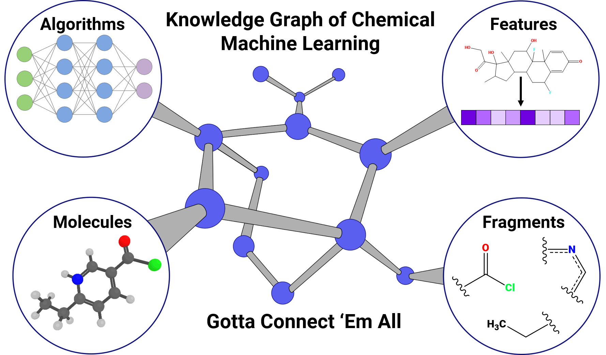
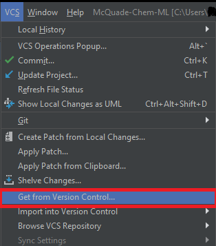
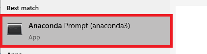
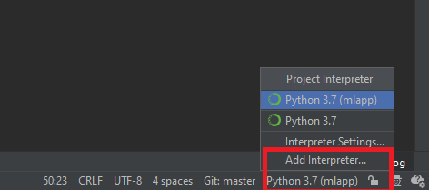

# MLKG



A Python pipeline for creating basic machine learning models for chemical property predictions.
The models are used to populate a Neo4j property graph database. 

# Table of Contents
**[Data Sets](#data-sets)**<br>
**[Available Models](#available-models)**<br>
**[Requirements](#requirements)**<br>
**[Important Dependencies](#important-dependencies)**<br>
**[Conda Environment](#conda-environment)**<br>
**[Neo4j](#neo4j)**<br>
**[MySQL](#mysql)**<br>
**[Running main.py](#running-mainpy)**<br>
 
## Data Sets
Currently we are using three datasets from MoleculeNet.ai: Lipophilicity, FreeSOLV and ESOL
 and three datasets retreived from tutorials and publications: LogP14k, jak2-pIC50, and flashpoint.  
 The CSVs for the datasets can be found in `/dataFiles`

## Available Models
Our program supports Scikit-Learn algorithms for random forest (RF), gradient decent boost (GDB),
 support vector machines (SVM), Adaboost, and k-nearest neightbors (KNN).   We implement dense neural networks
 with Tensorflow and the Keras API.

## Requirements

Neo4j download link: https://neo4j.com/download/

Git download link: https://git-scm.com/downloads

Anaconda download link: https://www.anaconda.com/distribution/

(Optional) Pycharm download link (windows): https://www.jetbrains.com/pycharm/download/#section=windows

If you're using Pycharm, use it's "Get from Version Control" option to clone our repository (you can copy/paste this link: https://github.com/Dlux804/McQuade-Chem-ML).

 

## Important Dependencies
- Python 3.7 or 3.6
- rdkit=2020.09.1.0
- py2neo=4.2.0
- scikit-learn=0.23.2
- descriptastorus=2.2.0
- scikit-optimize=0.8.1
- tensorflow-gpu==1.15.0

## Conda Environment

- Create a conda virtual environment in  Anaconda Prompt from the `mlapp.yml` file and the `requirements.txt` in our `env_init` folder. This
should work on both Windows and Ubuntu.

    ```conda env create -f mlapp.yml```
    
    ```conda activate mlapp```
    
    ```pip install -r requirements.txt```

#### For Pycharm users (Optional)

 - In Pycharm, go to the bottom right and hit the interpreter button. Select "Add interpreter".
 
 
 
 
 
 
 
 
- Navigate to "Conda Environment" and select "Existing environment". 
The mlapp\python.exe environment should be located in the Anaconda3\envs folder. Select this interpreter and check "Make available to all projects". Hit OK. You should now be able to run our code.
 
#### 
 
## Neo4j
To output models into Neo4j, first you will need to create a local Database
 1. Open Neo4j and add a `Local DBMS`
 2. The Name of the DBMS is up to the users to decide. However, you must set your password to `password` for our code to work as it is.
 3. If you want to set your password to something else, you need to go to your function of choice in **main.py** and input the `password` parameter your Neo4j password.  
 4. Download the APOC and Graph Data Science (GDS) library plugins. If you're using the latest edition of Neo4j, GDS will be pre-installed for you.

## MySQL
MySQL saves time by storing featurized datasets. The instructions to install MySQL for both Windows and Linux 
can be found at https://dev.mysql.com/doc/mysql-getting-started/en/. 

If installing on Windows, the Server only version is highly recommend. 
Further instructions for windows can be found at https://phoenixnap.com/kb/install-mysql-on-windows.

A new user and data table should be created. The MySQL server can be access in Windows by opening the command prompt and typing in

```cd Program Files\MySQL\MySQL Server 8.0\bin```

```mysql -u root -p```

For Linux, open the terminal and type in

```mysql -u root -p```

Then type in the password that was used to setup the root user. Then instructions to create a new database and
user can be found here https://matomo.org/faq/how-to-install/faq_23484/. Then enter you parameters in the line in main.py 

```model.connect_mysql(user='user', password='dolphin', host='localhost', database='featurized_datasets', initialize_all_data=False)```

To the parameters you used to setup your database. 

If you wish to use MySQL, then set
```model.featurize(retrieve_from_mysql=False)``` to ```model.featurize(retrieve_from_mysql=True)``` in **main.py**. 

As stated before,
MySQL is not required and only helps to speed up featurization of data. Also, an IDE such as DataGrip is also useful to see the 
data tables being created by main.py.
 
## Running main.py

These are your options in **main.py**:
- **multi_models()**: Create a large variety of machine learning models and load them to Neo4j

- **some_models()**: Create a few example machine learning models and load them to Neo4j

- **single_model()**: Create a single example machine learning model and load them to Neo4j

- **load_example_to_neo4j()**: Load example machine learning models directly to Neo4j

- **example_qsar_models_to_neo4j()**: Load example qsar models directly to Neo4j


### Steps:
1. Start your Neo4j local DBMS and let it run to completion
2. Select your function of choice in main.py
3. If you're using the command prompt, activate your `mlapp` environment and enter `python main.py`
4. Enjoy!! 