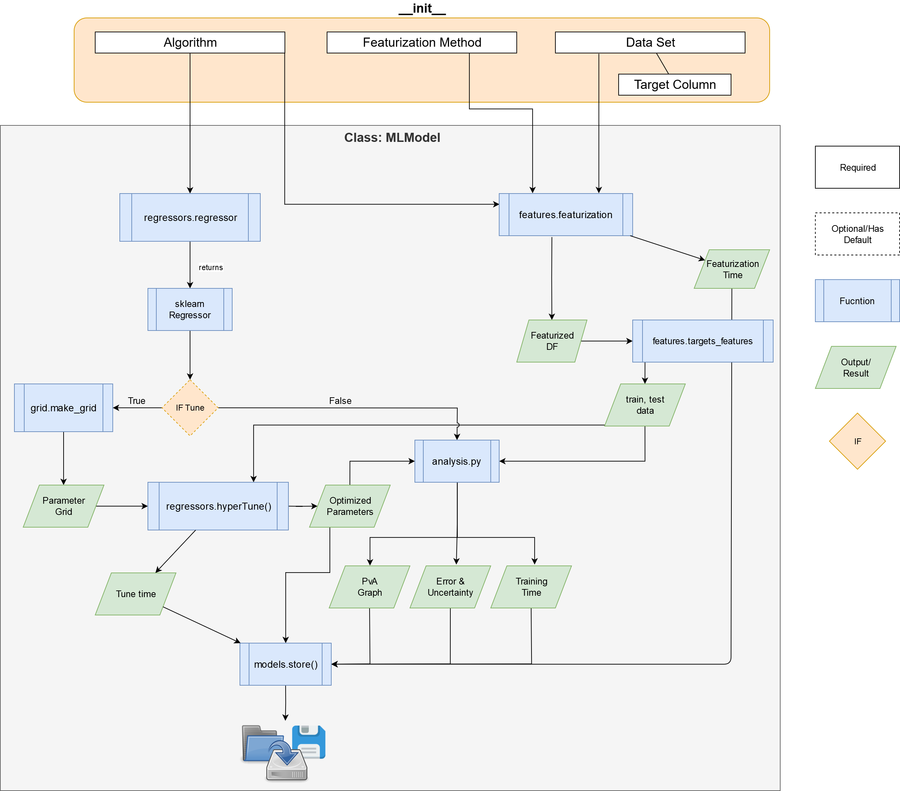

# McQuade-Chem-ML
Development of easy to use and reproducible ML scripts for chemistry.  

## Data Sets
Currently we are using three datasets from MoleculeNet.ai: Lipophilicity, FreeSOLV and ESOL and two datasets retreived from tutorials: LogP14k and jak2-pIC50.

## Available Models
Our program supports random forest (RF), gradient decent boost (GDB), support vector machines (SVM), Adaboost, and k-nearest neightbors (KNN).   

### Getting Set Up
The following will serve as a guide for getting our models running on your computer.

**NOTE:** YOU MUST HAVE GIT, PYCHARM, AND ANACONDA INSTALLED IN ORDER TO USE THE FOLLOWING INSTRUCTIONS. However, it is possible to run our models using different programs (GIT is required to clone our repository).

Git download link: https://git-scm.com/downloads

Pycharm download link (windows): https://www.jetbrains.com/pycharm/download/#section=windows

Anaconda download link: https://www.anaconda.com/distribution/

 With Git, Pycharm, and Anaconda installed, use Pycharm's "get from version control" option to clone our repository (you can copy/paste this link: https://github.com/Dlux804/McQuade-Chem-ML).

 

### Dependencies
We should all be using the same conda evironment so that we do not run into the issue
of "Well it works on my machine".  To do this, we will host a .yml file for the shared
environment on our repo (mlapp.yml).

1. Create an conda virtual environment in the Anaconda prompt from the mlapp.yml file
 ```conda env create -f env_init\mlapp.yml```
 Note: On windows, you will have you comment out "-gunicorn" in the mlapp.yml file.
 
 
 
 
 
 2. In Pycharm, go to the bottom right and hit the interpreter button. Select "Add interpreter".
 
 
 
 
 3. Navigate to "Conda Environment" and select "Existing environment". The mlapp\python.exe environment should be located in the Anaconda3\envs folder. Select this interpreter and check "Make available to all projects". Hit OK. You should now be able to run our code.
 
  
 
 4. Update the virtual environment as necessary using ```conda install```
 5. Update the mlapp.yml file using ```conda env export > mlapp.yml --no-builds --from-history```. Make sure that you add the 
 mlapp.yml file to git, if it not already being watched.

    **Note:** Sometimes packages cannot be installed from conda, such as descriptastorus.
    If this is the case, you may need to use pip to install from a github link.
    See the mlapp.yml file for an example (descriptastorus) for an example of how to account for this
    in the mlapp.yml file.  
    ```
    - pip:
        - "git+git://github.com/bp-kelley/descriptastorus.git#egg=descriptastorus"
    ```
 6. Commit your changes, which include the mlapp.yml file. ```git commit -m "your commit message here"```
 
 
# Workflow

## MLModel Class
This is the overview of our MLModels Python class functions.  ```main.py``` essentially just iteratively runs this workflow with different input algorithms, data sets and featurization methods.   


### File Tree


 * [barzilay_predictions](./barzilay_predictions)
   * [delaney_toy.csv](./barzilay_predictions/delaney_toy.csv)
   * [delaney_toy_smiles.csv](./barzilay_predictions/delaney_toy_smiles.csv)
   * [logger_dir](./barzilay_predictions/logger_dir)
   * [barzilay_predictions.csv](./barzilay_predictions/barzilay_predictions.csv)
 * [env_init](./env_init)
   * [mlapp.yml](./env_init/mlapp.yml)
 * [main.py](./main.py)
 * [core](./core)
   * [barzilay_predict.py](./core/barzilay_predict.py)
   * [features.py](./core/features.py)
   * [grid.py](./core/grid.py)
   * [hte-models.py](./core/hte-models.py)
   * [ingest.py](./core/ingest.py)
   * [regressors.py](./core/regressors.py)
   * [misc.py](./core/misc.py)
   * [analysis.py](./core/analysis.py)
   * [models.py](./core/models.py)
 * [tests](./tests)
   * [test_ingest.py](./tests/test_ingest.py)
   * [test_features.py](./tests/test_features.py)
 * [output](./output)
 * [examples_scripts](./examples_scripts)
   * [descriptastorus-example.py](./examples_scripts/descriptastorus-example.py)
   * [barzilay_predict_example.py](./examples_scripts/barzilay_predict_example.py)
 * [dataFiles](./dataFiles)
   * [ESOL.csv](./dataFiles/ESOL.csv)
   * [jak2_pic50.csv](./dataFiles/jak2_pic50.csv)
   * [Lipophilicity-ID.csv](./dataFiles/Lipophilicity-ID.csv)
   * [logP14k.csv](./dataFiles/logP14k.csv)
   * [water-energy.csv](./dataFiles/water-energy.csv)
 * [graphics](./graphics)
   * [hte-models-overview](./graphics/hte-models-overview)
   * [hte-models-overview.drawio](./graphics/hte-models-overview.drawio)
   * [hte-models-overview.png](./graphics/hte-models-overview.png)
   * [hte-models-overview.svg](./graphics/hte-models-overview.svg)
 * [README.md](./README.md)
 * [toc.sh](./toc.sh)
 
 
