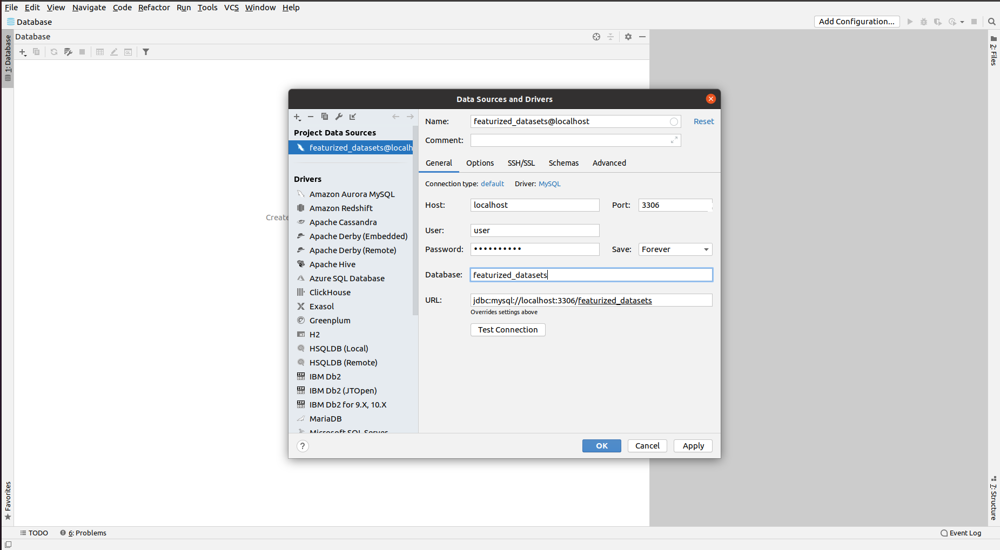

# General Notes
The installation notes are designed for a machine running Ubuntu 20.04, but these
instructions are likely to work on any linux box.

# Install mysql
    sudo apt install mysql-server

# Configure MySql
    sudo mysql_secure_installation

Here you will setup a username and password and the settings you want for mysql.
Enter a secure password, and then the following settings I used were.

	Remove anonymous users?: yes
	Disallow root login remotely?: yes
	Remove test database and access to it?: yes
	Reload privilage tables now?: yes
	
The test database is strictly for testing purposes, and we want to enter our own
data.
	
# Enter into mysql
    sudo mysql

If that does not work, try: 

    mysql -username root -password

# Then create a user
    mysql> CREATE USER '<username>'@'localhost' IDENTIFIED WITH mysql_native_password BY '<password>';

I used username = user and password = Lookout@10 

*Do not use the same password for this as the installation password
	
# Then create a new database

    mysql> CREATE DATABASE if not exists <database_name>;

I used featurized_datasets as my database name.

# Then give user permissions to modify tables and databases

    GRANT ALL PRIVILEGES ON *.* TO '<username>'@'localhost' WITH GRANT OPTION;
    
Note, that this will give the user root access, this can be modified later if desired.

Then flush the cache, this is just good practice.

    mysql> FLUSH PRIVILEGES;

Now MySql is all setup and ready to be used with Python

It is recommend to setup datagrip, however, to easily see and modify tables created

# Setup DataGrip

First step is to install datagrip.
Then hit the plus button to configure a new database, add a new data source, and 
select mysql

Afterwards, you should use the credentials you used to setup your USER and DATABASE

[Note: you may get an error about timezones. Do not worry about this if you only plan to have this a local host. 
If we ever plan to share this database, then we can worry about that later]

But after this, you should have datagrip and mysql configured and ready to use with python

Then go to main.py and run example_run_with_mysql_and_neo4j. 
Be sure to pass in your creditials. I would recommend running it twice to see 
that we do not need to featurize more than once

Also, you can go to datagrip to see tables being added in. 
Just refresh the database to see the data being insertted in. 
