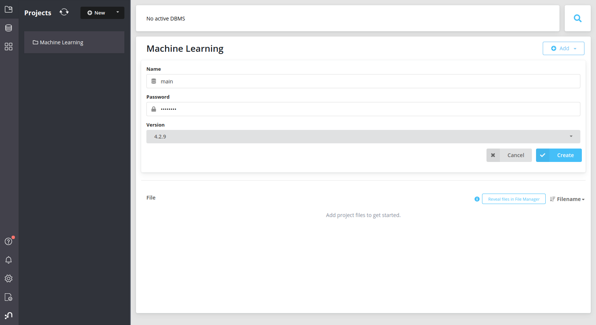
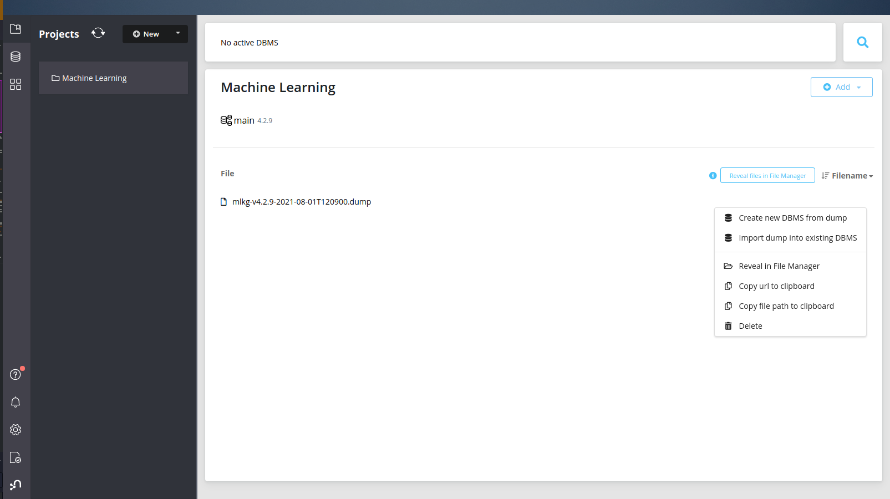
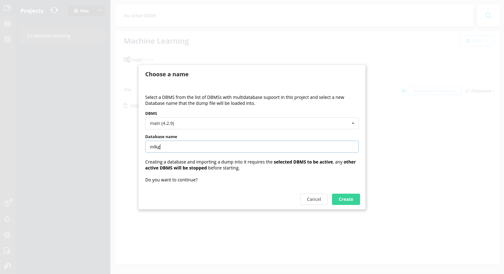

# Using Pre-built Machine Learning Knowledge Graph

This file outlines how to get a working machine learning knowledge graph,
mlkg, using a Neo4j dump file of a pre-made mlkg.
This is useful for people who do not want to run models in python,
or for those how want to quickly see what the product from this code looks like.
Neo4j does still need to be downloadeded,
and the Neo4j Desktop is highly recommended.

Neo4j download link: https://neo4j.com/download/

[//]: # (TODO make sure that this file is updated to correct name)
Dump file download: https://github.com/Dlux804/McQuade-Chem-ML/blob/master/mlkg-linux-v-2-neo4j-2021-08-01T120900.dump

If you did not download download the Neo4j Desktop,
then instructions for you to import the dump file into your database can be found here
https://neo4j.com/docs/operations-manual/current/backup-restore/restore-dump/.
DBMS verison 4.2.9 was used to create the dump file,
and the same DBMS verison is needed to restore from the dump file.

The rest of these instructions will be for the Neo4j Desktop application only.
Please note that Neo4j Desktop version 1.4.7 was used for this tutorial.
If you are using a newer verison, the instructions may vary some.

After downloading and installing Neo4j Desktop and the dump file above, create a new project.
The project name is not important.

Then click on Add > Local DBMS

It is very important what version you choose for the LOCAL DBMS,
as it needs to match the version of the DBMS that the dump file came from.
The DBMS version that the dump came from was 4.2.9,
to import the dump file from above select version 4.2.9.

The name of the local DBMS is not important either,
but it is recommended not to name this mlkg.
For most demo purposes, the password is not important either.
Neo4j Desktop stores database password locally by default.
If you need to access this database through an API,
then it is recommeded to save this password elsewhere.

Then hit Create.

**NOTE DO NOT START THE LOCAL DBMS.**

The dump file needs to first be imported before starting the database.
As starting now may cause the step of importing the dump file to fail.

Next, add the dump file to Neo4j Desktop by going Add > File

Then select the dump file you downloaded earlier.
The dump file should appear at the bottom of the screen.

Next, import the dump file into the Local DBMS by

hovering over the dump file in Neo4j Desktop >
clicking on the three dots next to Open >
Import dump into existing DBMS

Then select the DBMS that you made earlier.
The `Database name` is important, as Neo4j is very picky about database names.
It is recommended to use the database name mlkg.

Then hit create

Importing the dump file may take a few minutes,
depending on CPU and Storage performace.
Also, this step may use a sigificant amount of RAM.

Now, you can click on Open in the top right corner which will open the Neo4j Browser.
There will be no Nodes or Relationships present at frist.
Click on the Database icon in the top left corner of the Neo4j Browser.
Then go to `Use database` and click on the database name that you used earlier.

After selecting the correct database, the Nodes and Relationships should show up.
If they do not, then run the query `MATCH (n) RETURN n LIMIT 1`

If you are completely unfamilar with Neo4j Cypher,
Neo4j Cypher is a very intutive querying language.
It is not hard to learn compared to other database languages,
espcially if you have prior programming knowledge.
Intro the Neo4j Cypher can be found at
https://neo4j.com/developer/cypher/intro-cypher/.
